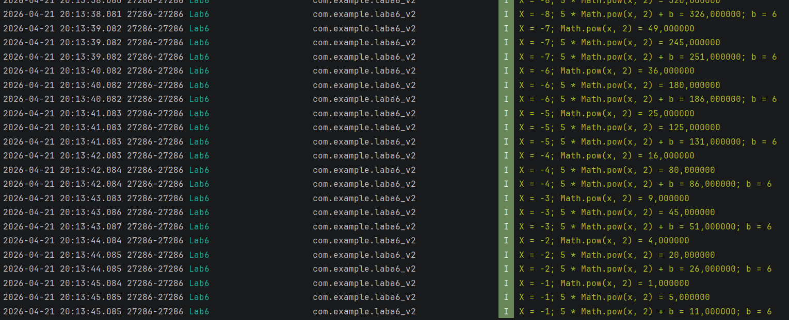
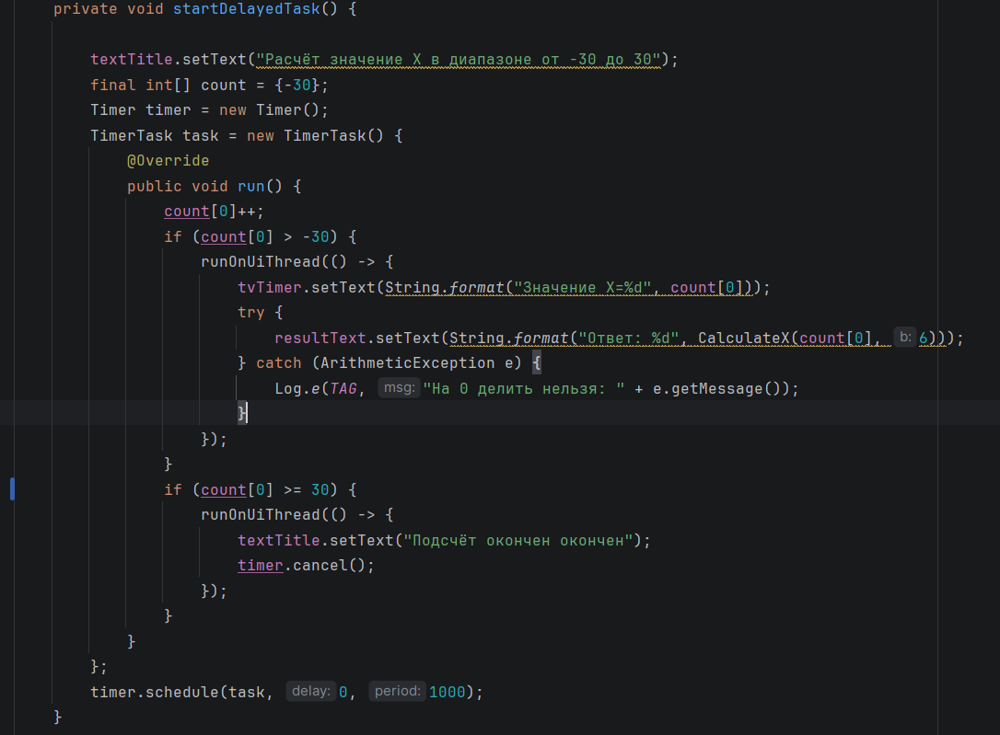

# Отчет

## Практическая работа №6

## Отладка приложений. Использование Logcat и таймеров

**Выполнил:**  
Самойлов Павел Олегович 
**Курс:** 2  
**Группа:** ИНС-б-о-24-1
**Направление:** 09.03.02
**Профиль:** Информационные системы и вычислительная технника

**Проверил:**  
Потапов Иван Романович 

---

### Цель работы

Изучить инструменты отладки Android-приложений. Научиться использовать Logcat для логирования сообщений различных уровней, а также применять таймеры (Timer, Chronometer) для выполнения отсроченных и периодических задач.

### Ход работы

Задание. 
1. Создайте приложение с одной Activity.
2. Добавьте TextView для отображения текущего значения/результата.
3. Добавьте кнопку "Старт", запускающую таймер.
4. Все промежуточные вычисления должны логироваться в Logcat с тегом "Lab6".
5. Период обновления (шаг) — 1 секунда.

Индивидуальное задание. 
x меняется от -30 до 30 с шагом 1 в секунду. Вычислять F по формуле:

F = { ax² + b, при x < 0 и b ≠ 0; (x - a)/(x - c), при x > 0 и b = 0; x/c в остальных случаях }

*Рисунок 1. Функция расчёта формулы по заданию*

*Рисунок 2. Логиррование на уровне Info по тегу Lab6*

Для работы был взят класс Timer, который запускает счёт. Для контроля счёта была создана переменная final int[] count = {-30}, с установкой начального значения. По условию индивидуального задания, когда x=30, то счёт прекратится. Для обработкаи исключения, при b=0 был использован оператор try - catch и прописан уровень логгирования Error. 

*Рисунок 3. Функция отображения результата*

### Вывод
В результате выполнения практической работы я изучил инструменты отладки Android-приложений. Научился использовать Logcat для логирования сообщений различных уровней, а также применять таймеры (Timer, Chronometer) для выполнения отсроченных и периодических задач.

### Ответы на контрольные вопросы
1. Какие уровни логирования существуют в Android? Для каких целей используется каждый из них?

Log.v(String tag, String msg) — Verbose (подробный). Используется для самой детальной отладочной информации. Не включается в сборку релизной версии приложения.

Log.d(String tag, String msg) — Debug (отладка). Информация, полезная для отладки. Также обычно отключается в релизных сборках.

Log.i(String tag, String msg) — Info (информация). Информационные сообщения о нормальной работе приложения.

Log.w(String tag, String msg) — Warning (предупреждение). Указывает на потенциально опасную ситуацию, которая не является ошибкой, но может ей стать.

Log.e(String tag, String msg) — Error (ошибка). Сообщения об ошибках, которые произошли в приложении.

2. Как открыть окно Logcat в Android Studio? Как отфильтровать сообщения только по тегу и только по уровню Error?

Открыть Logcat: View → Tool Windows → Logcat.

Фильтрация: Только по тегу: в строке поиска напиши tag:MyTag

3. В чем разница между методами Log.e() и Log.w()? Приведите примеры использования.

Log.e(String tag, String msg) — Error. Используется, когда произошла реальная ошибка

Log.w(String tag, String msg) — Warning. Используется, когда произошло неожиданное событие, но приложение может продолжить работу

<dev>
  try {
    val result = api.callNetwork()
    Log.i(TAG, "Успешный запрос")
  } catch (e: Exception) {
      Log.e(TAG, "Ошибка при запросе к серверу", e)
  }

  if (batteryLevel < 15) {
      Log.w(TAG, "Низкий уровень батареи: $batteryLevel%")
  }
</dev>

4. Что такое точка останова (breakpoint)? Как запустить приложение в режиме отладки?

Breakpoint — это специальная метка в коде, при достижении которой выполнение программы приостанавливается.

Как поставить breakpoint: Кликнуть слева от номера строки, Нажми кнопку Debug

5. Как выполнить код с задержкой в Android? Назовите не менее двух способов.

Использование Handler и Runnable; Использование CountDownTimer; Использование ScheduledExecutorService

6. В чем проблема обновления UI из задачи, выполняемой в TimerTask? Как её решить?

TimerTask выполняется в фоновом потоке. Прямое обновление UI-элементов textView.text = "...", button.visibility = ... из другого потока приводит к исключению CalledFromWrongThreadException или крашу приложения.

Решение: использовать Handler, runOnUiThread() или post() для возврата в главный поток.

7. Для чего используется класс Chronometer? Какие основные методы у него есть?

Chronometer — это виджет, который показывает таймер, отсчитывающий время. 

Основные методы:

start() — запустить отсчёт
stop() — остановить
setBase(long base) — установить начальное время
setCountDown(boolean countDown) — переключить в режим обратного отсчёта
setFormat(String format) — задать формат отображения
getBase() — получить текущее базовое время
setOnChronometerTickListener() — слушатель тика каждую секунд

8. Чем CountDownTimer отличается от Timer? В каких случаях удобнее использовать CountDownTimer?

CountDownTimer удобнее использовать, когда:

Нужно показать обратный отсчёт; 
Требуются регулярные обновления UI каждую секунду: 
Не нужна сложная логика — просто «отсчитать N миллисекунд».

Timer лучше, когда нужна более гибкая периодическая задача в фоне
