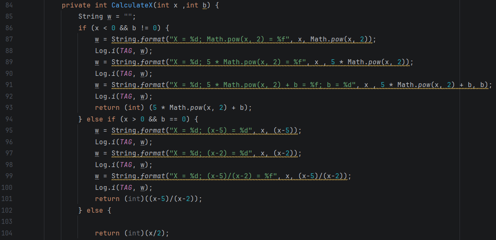

# Отчет

## Практическая работа №6

## Отладка приложений. Использование Logcat и таймеров

**Выполнил:**  
Самойлов Павел Олегович 
**Курс:** 2  
**Группа:** ИНС-б-о-24-1
**Направление:** 09.03.02
**Профиль:** Информационные системы и вычислительная технника

**Проверил:**  
[Должность]  
Потапов Иван Романович 

---

### Цель работы

Изучить инструменты отладки Android-приложений. Научиться использовать Logcat для логирования сообщений различных уровней, а также применять таймеры (Timer, Chronometer) для выполнения отсроченных и периодических задач.

### Ход работы

Задание. 
1. Создайте приложение с одной Activity.
2. Добавьте TextView для отображения текущего значения/результата.
3. Добавьте кнопку "Старт", запускающую таймер.
4. Все промежуточные вычисления должны логироваться в Logcat с тегом "Lab6".
5. Период обновления (шаг) — 1 секунда.

Индивидуальное задание. 
x меняется от -30 до 30 с шагом 1 в секунду. Вычислять F по формуле:

F = { ax² + b, при x < 0 и b ≠ 0; (x - a)/(x - c), при x > 0 и b = 0; x/c в остальных случаях }

*Рисунок 1. Функция расчёта формулы по заданию*

*Рисунок 2. Результат выполнения тестового примера*

*Примечание по вставке изображений:*
*Скриншоты необходимо предварительно загрузить в репозиторий (например, в папку `images/`). Ссылка должна вести на файл внутри репозитория, а не на локальный диск вашего компьютера.*

### Вывод
В результате выполнения практической работы я [краткий вывод: что изучил, чему научился, что разработал].

### Ответы на контрольные вопросы
1.  **Вопрос 1:** [Ваш развернутый ответ на первый вопрос из методички].
2.  **Вопрос 2:** [Ваш ответ на второй вопрос].
3.  **Вопрос 3:** [Ваш ответ на третий вопрос].
